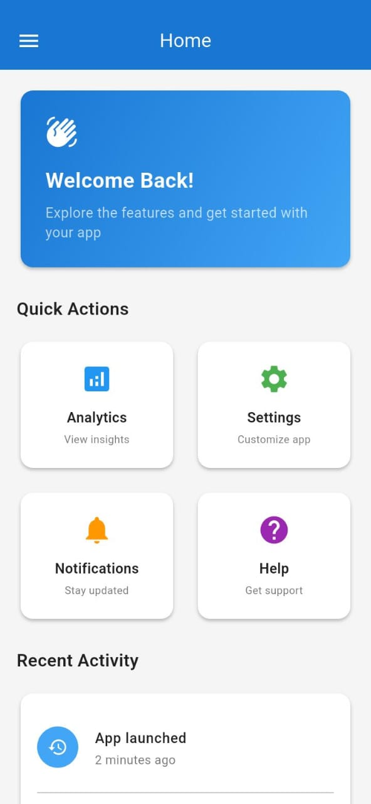
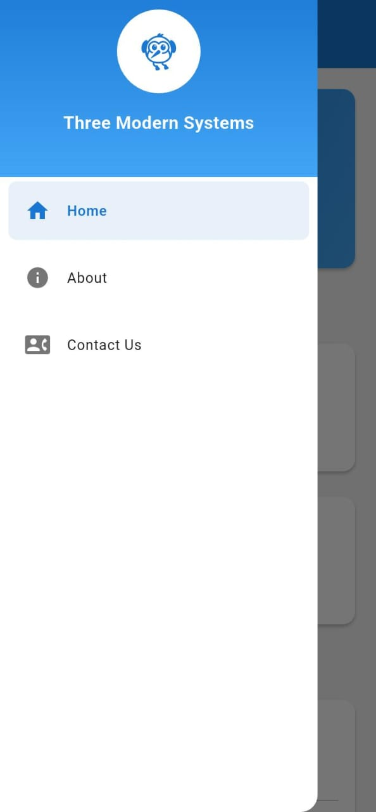
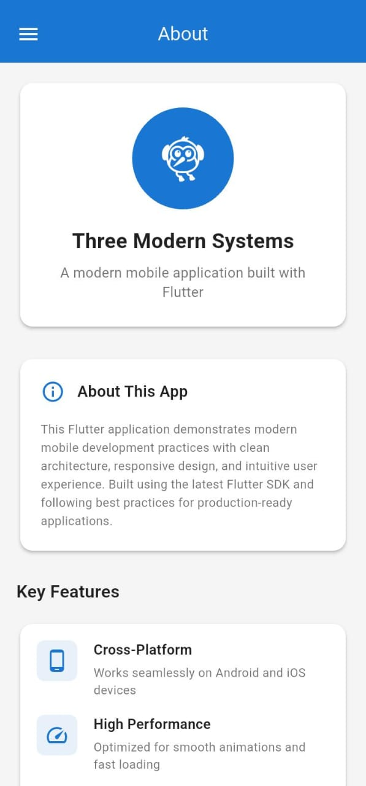
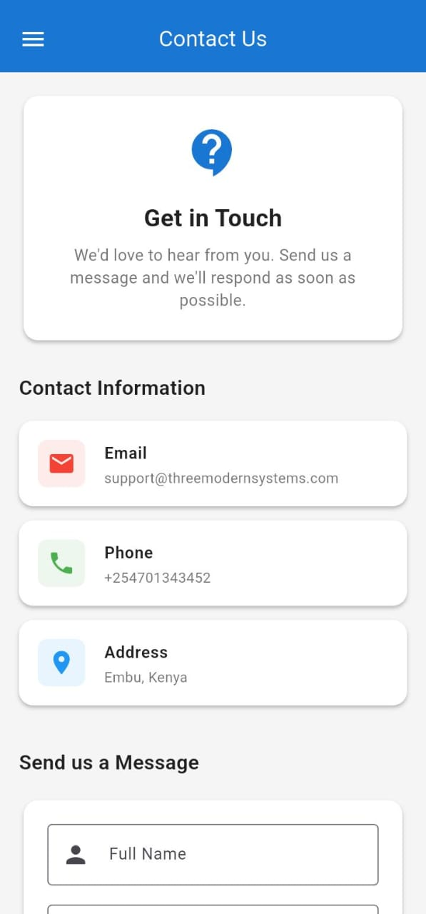

# Alex Nyambura

A Flutter application showcasing a clean and modern mobile app interface.

## Features

- Modern Material Design UI
- Navigation drawer with multiple sections
- Home, About, and Contact fragments
- Responsive layout
- Clean architecture with organized code structure

## Screenshots






## Getting Started

### Prerequisites

- Flutter SDK (latest stable version)
- Dart SDK
- Android Studio or VS Code
- Android device or emulator

### Installation

1. Clone the repository:
   ```bash
   git clone https://github.com/lxmwaniky/basic-app.git
   cd basic-app
   ```

2. Install dependencies:
   ```bash
   flutter pub get
   ```

3. Run the app:
   ```bash
   flutter run
   ```

## Project Structure

```
lib/
├── fragments/          # UI fragments for different sections
│   ├── home_fragment.dart
│   ├── about_fragment.dart
│   └── contact_fragment.dart
├── screens/           # Main screens
│   └── main_screen.dart
├── utils/             # Utilities and themes
│   └── app_theme.dart
├── widgets/           # Reusable widgets
│   └── app_drawer.dart
└── main.dart          # App entry point
```

## Built With

- [Flutter](https://flutter.dev/) - UI toolkit for building natively compiled applications
- [Dart](https://dart.dev/) - Programming language optimized for building mobile apps

## Author

**Alex Nyambura** - [lxmwaniky](https://github.com/lxmwaniky)

## License

This project is open source and available under the [MIT License](LICENSE).